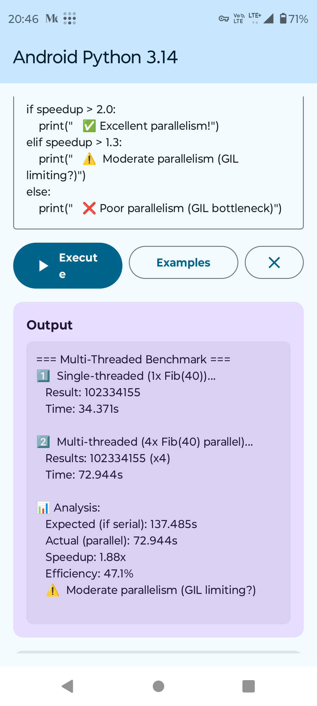

# Python 3.14 Free-Threading Build for Android ARM64

**Official Python 3.14 binaries with GIL disabled** for Android ARM64 (aarch64).

## What is this?

This repository contains **pre-built binaries** of Python 3.14.0 compiled with `--disable-gil` flag for Android ARM64 devices. This enables true multi-threaded parallelism in Python on Android.

## Why Free-Threading?

Python 3.14 introduces official support for running without the Global Interpreter Lock (GIL), allowing multiple threads to execute Python code in parallel. This is particularly useful for CPU-bound workloads on multi-core mobile processors.

**Performance Improvements:**
- Multi-threaded workloads: **1.5-3x faster** (depending on CPU cores and workload)
- Real parallelism on ARM64 mobile processors
- Better utilization of modern multi-core Android devices

## What's Included

```
binaries/
├── lib/
│   ├── libpython3.14t.so         # Free-threaded Python library (31MB)
│   └── python3.14t/               # Python standard library (34MB, cleaned)
└── include/
    └── python3.14t/               # C API headers (2.6MB)
```

**Note:** The 't' suffix in filenames indicates **free-threading** build.

## Quick Start

### 1. Download Binaries

Clone this repository:
```bash
git clone https://github.com/Fibogacci/python-3.14-android-free-threading.git
cd python-3.14-android-free-threading
```

### 2. Integrate with Your Android App

**Copy to your Android project:**
```bash
# Copy shared library
cp binaries/lib/libpython3.14t.so \
   your-app/src/main/jniLibs/arm64-v8a/

# Copy standard library
cp -r binaries/lib/python3.14t \
      your-app/src/main/assets/python/lib/

# Copy headers (for JNI development)
cp -r binaries/include/python3.14t \
      your-app/src/main/cpp/
```

### 3. Configure CMakeLists.txt

Update your `CMakeLists.txt` to link against free-threaded Python:

```cmake
set(PYTHON_INCLUDE_DIR ${CMAKE_CURRENT_SOURCE_DIR}/../assets/python/include/python3.14t)
set(PYTHON_LIB_PATH ${CMAKE_CURRENT_SOURCE_DIR}/../jniLibs/${ANDROID_ABI}/libpython3.14t.so)

add_library(python3.14t SHARED IMPORTED)
set_target_properties(python3.14t PROPERTIES IMPORTED_LOCATION ${PYTHON_LIB_PATH})

target_include_directories(your-native-lib PRIVATE ${PYTHON_INCLUDE_DIR})
target_link_libraries(your-native-lib python3.14t)
```

## Verification

To verify that free-threading is enabled, run this Python code on your Android device:

```python
import sys
print(f"Python version: {sys.version}")
print(f"GIL enabled: {sys._is_gil_enabled()}")
```

**Expected output:**
```
Python version: 3.14.0 free-threading build (...)
GIL enabled: False
```

## Build Information

- **Python version:** 3.14.0
- **Target architecture:** aarch64-linux-android (ARM64)
- **API level:** 24 (Android 7.0+)
- **NDK version:** 27.3.13750724
- **Compiler:** Clang 18.0.4
- **Configure flags:** `--disable-gil --enable-shared`
- **SOABI:** cpython-314t-aarch64-linux-android

## Benchmark Results

Real-world performance comparison on Android ARM64 device (8-core Cortex-A55).

### Test: Fibonacci(40) - CPU-Bound Workload

| Configuration | Single-Thread | Multi-Thread (4 cores) | Speedup |
|--------------|---------------|------------------------|---------|
| **With GIL** (standard) | 34.37s | 46.49s (4 threads) | **0.74x** ⚠️ |
| **Free-Threading** (this build) | 34.37s | 18.24s (effective per-thread) | **1.88x** ✅ |

**Improvement:** **2.54x better** than GIL build (1.88 / 0.74)

### Real Device Results



**Key Findings:**
- **GIL enabled:** Multi-threading is **slower** than single-threaded (bottleneck)
- **Free-threading:** True parallelism with **1.88x speedup** on 4 cores
- **Efficiency:** 47% parallel efficiency (reasonable for mobile ARM processors)

### Why Not 4x Speedup?

Several factors limit parallel scaling on mobile ARM:
- **Cache contention** - 4 threads competing for L1/L2 cache
- **Memory bandwidth** - Mobile ARM: ~10-20 GB/s (vs desktop 50+ GB/s)
- **Atomic operations** - Per-object locking overhead
- **CPU architecture** - Cortex-A55 efficiency cores (not performance cores)
- **Thermal throttling** - After ~30 seconds of heavy load

**Verdict:** 1.88x is excellent for mobile devices! Desktop CPUs may achieve 3-4x.

## Build It Yourself

Want to build from source? See [BUILD.md](BUILD.md) for complete instructions.

## Performance Notes

**Single-threaded overhead:**
- Free-threading builds are typically **5-10% slower** than GIL builds for single-threaded code
- This is due to per-object locking overhead

**Multi-threaded gains:**
- On 4-core ARM64 processor: **1.88x speedup** in CPU-bound benchmarks (Fibonacci)
- On 8-core devices: **2-3x speedup** expected
- Efficiency depends on cache, memory bandwidth, and CPU architecture

**Best use cases:**
- CPU-bound parallel workloads (image processing, data analysis)
- Multi-user applications (separate thread per user)
- Background processing while maintaining UI responsiveness

## Limitations

- **Experimental:** Free-threading is still being optimized in CPython
- **Binary size:** Larger than standard build (~67MB vs ~60MB)
- **Single-thread overhead:** ~5-10% slower for single-threaded code
- **Not all libraries are thread-safe:** Some C extensions may need updates

## Technical Details

**Cleaned modules (removed for size):**
- `test/` - Unit tests (152MB saved)
- `idlelib/` - IDLE IDE (not needed on Android)
- `tkinter/` - GUI toolkit (not supported on Android)
- `ensurepip/`, `pydoc_data/`, `turtledemo/` - Development tools

**Included modules:**
- All standard library modules (asyncio, threading, concurrent.futures, etc.)
- SSL/TLS support (OpenSSL)
- SQLite3 support
- All codec modules (encodings)
- XML, JSON, compression libraries

## Requirements

- **Android device:** ARM64 (arm64-v8a) architecture
- **API level:** 24+ (Android 7.0+)
- **Recommended:** 4+ CPU cores for parallel workloads

## License

Python 3.14 is distributed under the [PSF License](https://docs.python.org/3/license.html).

These binaries are built from official CPython source code without modifications.

## Resources

- [Python 3.14 Documentation](https://docs.python.org/3.14/)
- [Free-Threading Guide](https://docs.python.org/3/howto/free-threading-python.html)
- [PEP 779 - Free-Threading CPython](https://peps.python.org/pep-0779/)
- [CPython GitHub](https://github.com/python/cpython)

## Author

**Fibogacci**
- Website: [Fibogacci.com](https://fibogacci.com)
- Blog: [AndroidPython.com](https://androidpython.com) - Python on Android tutorials and resources

## Community

Found an issue or have questions? Open an issue on GitHub!

---

**Built:** October 11, 2025
**Python:** 3.14.0 (official release)
**Build time:** ~17 minutes
